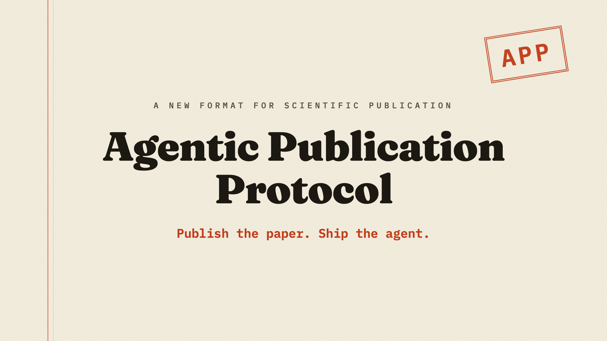

# Agentic Publication Protocol: An Attempt to Modernize Scientific Publication

Sirui Lu and Xiao-Liang Qi

This repository is an APP publication for a paper proposing the
[Agentic Publication Protocol](https://github.com/LionSR/AgenticPublicationProtocol)
(APP): a repository-and-release format for publishing
scientific work as an organized, agent-readable bundle of paper, code, data,
environment notes, reproduction instructions, and `AGENTS.md`.

The core idea is that scientific publications should carry not only final
knowledge, but also operational know-how that helps future readers understand,
reproduce, and build on the work.

## Overview Video

[](https://youtu.be/KJ7UGFzRen4)

▶ **[Watch on YouTube](https://youtu.be/KJ7UGFzRen4)** &nbsp;·&nbsp; local copy: `supplementary/promo-video/out/app-promo.mp4`

## Talk To This Paper

Clone this repository and open it in an AI coding agent that reads `AGENTS.md`.
The agent should use the paper, code, and data included in this repository as
ground truth, while treating supplementary materials and skills as secondary
context.

Canonical files:

- `AGENTS.md` - paper-agent instructions.
- `paper/app-paper.pdf` - compiled paper.
- `paper/app-paper.tex` - canonical paper source.
- `code/figure-reproduction/README.md` - figure/table reproduction map.
- `data/README.md` - local and external data notes.
- `environment/README.md` - tested environment and commands.

## Repository Contents

- `paper/` - manuscript source, compiled PDF, bibliography, and figures.
- `code/protocol_repo/` - APP protocol repository submodule at `v1.0.0`.
- `code/scripts/` - plotting, dataset, and bibliography scripts.
- `code/figure-reproduction/` - wrappers and status map for figures/tables.
- `data/` - compact compare-app score summary and data documentation.
- `skills/` - development and evaluation skills.
- `supplementary/promo-video/` - supplementary project video materials.
- `environment/` - setup and runtime notes.

## Reproducing Results

Use `environment/README.md` for setup notes. The lightweight default commands
use Python 3, matplotlib, and TeX Live/latexmk.

Print the compare-app table rows and regenerate the average-aspect figure:

```bash
python3 code/figure-reproduction/table_compare_app_scores.py
python3 code/figure-reproduction/fig_compare_app_average_aspects.py
```

Regenerate the research-network figure:

```bash
python3 code/figure-reproduction/fig_research_network.py
```

Compile the paper:

```bash
cd paper
latexmk -pdf -interaction=nonstopmode -halt-on-error app-paper.tex
```

Some figure artifacts are manual or backend-dependent. See
`code/figure-reproduction/README.md` for the authoritative status of every
paper figure and table.

## Data

The local release includes:

- `data/compare-app-benchmark/data/data_summary.json`
- `data/README.md`

The larger public benchmark records and example materials are hosted at:

https://huggingface.co/datasets/phynics/agentic-publication-protocol-dataset

## Code Availability

- APP protocol repository: https://github.com/LionSR/AgenticPublicationProtocol
- This APP publication/development repository:
  https://github.com/XiaoliangQi/agentic-publication-protocol-dev.app
- Hugging Face dataset:
  https://huggingface.co/datasets/phynics/agentic-publication-protocol-dataset

## Citation

```bibtex
@article{lu2026agenticpublicationprotocol,
  title={Agentic Publication Protocol: An Attempt to Modernize Scientific Publication},
  author={Lu, Sirui and Qi, Xiao-Liang},
  year={2026},
  url={https://github.com/XiaoliangQi/agentic-publication-protocol-dev.app}
}
```

## License

See `LICENSE` for reuse terms. In brief, the paper, figures, and supplementary
materials are under CC BY 4.0; code, scripts, skills, and runnable tooling are
under MIT; and `code/protocol_repo/` retains its upstream license.
